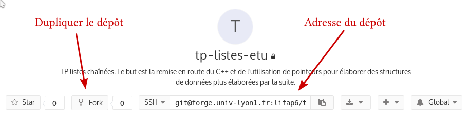

# Lifap6 — Liste chaînées

Ce TP a pour but de vous rafraîchir la mémoire sur la programmation en `C++` et
la conception de structures de données. Il prépare une séquence de TP à venir
sur les Skip-Lists qui sont une évolution des liste chaînées.

## Index

1. [Récupérer le code](#recuperer_le_code)
    * [Forge de l'université](#forge)
    * [Duplication du dépôt](#fork)
    * [Sauvegarder votre travail](#git_base)
    * [Intégration continue](#integration_continue)
1. [Listes chaînées](#listes_chainees)
    * [Cellules](#classe_cellule)
    * [Liste](#classe_liste)
    * [Fonctionnalités](#fonctionnalites)
    * [Recopie](#recopie)
    * [Ajout en queue](#ajout_en_queue)
    * [Serpent](#serpent)
1. [Rappels de `C++`](#rappels)
    * [Commentaires](#commentaires)
    * [Types primitifs](#types_primitifs)
    * [Case mémoire](#case_memoire)
    * [Tableau](#tableau)
    * [Structures de contrôle](#structures_de_controle)
    * [Références](#references)
    * [Passage par valeur](#passage_par_valeur)
    * [Adresses](#adresses)
    * [Allocation dynamique](#allocation_dynamique)
    * [Classes et structures](#classes_et_structures)

<a name="recuperer_le_code"></a>
## Récupérer le code

Ce TP vous est fourni sous la forme d'un dépôt utilisant un *outil de
versionnement* : git. Les outils de versionnement sont incontournables dans le
monde de la programmation. Ils permettent d'éviter la perte de données, de
suivre l'avancée du travail, de collaborer facilement à plusieurs sur un même
code.

<a name="forge"></a>
### Forge de l'université

L'université met à votre disposition une [forge](https://forge.univ-lyon1.fr)
sur laquelle vous vous trouvez, via le logiciel [gitlab](https://gitlab.com). La
forge est un outil en ligne pour gérer des dépôts git. Elle vous fournit en plus
la possibilité de consulter le dépôt en ligne, des outils de suivi de bugs, etc. 

Sur cette forge, vous avez la possibilité de créer autant de dépôts que vous le
souhaitez, pour vos codes, vos rapports, ou vos projets personnels. Par rapport
à [github](https://github.com), vous pouvez avoir gratuitement autant de projets
privés que vous le voulez et expérimenter sans que tout soit public.

<a name="fork">
### Duplication du dépôt



Vous pouvez vous contenter de cloner le dépôt, ou de le dupliquer sur la forge
pour avoir votre propre version que vous pouvez faire évoluer et sauvegarder.
Pour dupliquer le projet, utilisez le petit bouton <kbd>Fork</kbd> sous le titre
du projet. Cette action créera un nouveau dépôt dans votre espace personnel.

Une fois le dépôt cloné, sous le nom du projet, vous avez une adresse. À gauche
de cette adresse, sélectionnez HTTPS plutôt que SSH, sauf si vous avez
l'habitude de configurer d'utiliser SSH et de configurer des clés. Copiez
l'adresse proposée.

Dans votre terminal, naviguez là où vous souhaitez travailler, et utiliser la
commande

```bash
git clone <adresse>
```

Un dossier sera créé et vous pouvez commencer à travailler.

<a name="git_base"></a>
### Sauvegarder votre travail

Git est un outil permettant de *versionner* votre travail. À tout moment,
lorsque vous le souhaitez (et de préférence souvent), vous pouvez créer un
instantanné de l'état de votre travail. Quoi que vous fassiez par la suite, il
vous sera toujours possible de revenir à cet version. Cet instantanné est un
*commit*, et se génère avec la commande du même nom.

Commencez par choisir les fichiers dont vous voulez sauvegarder l'état. Vous
pouvez ajouter un fichier au commit via la commande

```bash
git add <votre fichier>
```

Une fois les fichiers choisis, vous pouvez taper

```bash
git status
```

pour avoir un récapitulatif de ce qui sera sauvegardé au prochain commit. Une
fois tous les fichiers sélectionnés, il vous reste à créer le commit :

```bash
git commit -m "Message du commit"
```

Votre commit est créé, vous pouvez continuer à travailler. Faites en sorte que
le message soit explicite, car il vous permettra d'identifier le commit si vous
avez besoin d'y revenir.

Vos commits sont des sauvegardes *locales*. Les autres personnes ayant accès à
votre dépôt ne peuvent pour l'instant pas les voir. Si votre disque dur crame,
votre travail reste perdu. Pour envoyer vos commits sur la forge, et ainsi les
rendre disponibles aux autres, et les sauvegarder plus solidement, vous pouvez
ensuite réaliser un *push* via :

```bash
git push
```

Cette commande vous demandera éventuellement de répondre à quelques questions la
première fois pour renseigner votre identiré, et dans tous les cas vous
demandera vos identifiants universitaires. Une fois votre travail poussé sur la
forge, vous pouvez vérifier sur l'interface que vos fichiers ont bien été mis à
jour.

<a name="integration_continue">
### Intégration continue

Si vous êtes déjà dépassé par ce qui précède, passez à la suite. Sinon, le dépôt
que vous venez de cloner est configuré pour l'*intégration continue*. C'est une
technique qui consiste à définir une batterie de tests sur votre code qui sera
lancée à chaque nouvelle version, pour s'assurer que rien n'a été cassé. À
chaque fois que vous pousserez votre travail sur la forge, les tests seront
lancés, et vos commits seront annotés avec le résultat (réussite ou échec). Vous
pouvez trouver les informations sur ces tests en cliquant sur "CI / CD" dans e
menu de gauche. Actuellement, deux tests sont configurés : la compilation et
l'éxécution. Vous pouvez en ajouter à votre guise.

<a name="listes_chainees"></a>
## Listes chaînées

Dans un premier temps, vous travaillerez sur les fichiers :

* Src/cellule.hpp/cpp
* Src/liste.hpp/cpp
* Src/test_liste.hpp/cpp

Un Makefile vous est fourni et préparé pour compiler le code.

Une liste chaînée est une structure de données dont le but est de stocker une
séquence de valeurs. La liste est composée d'un ensemble de *cellules*. Chaque
cellule contient une valeur, ainsi que l'adresse de la cellule suivante. Une
liste est généralement représentée par le schéma ci dessous.


L'intérêt de cette structure de données est de pouvoir facilement rajouter des
valeurs en tête de liste.

<a name="classe_cellule"></a>
### Classe cellule

Une cellule d'une liste chaînée contient une valeur et l'adresse de la cellule
suivante. Par convention, lorsque la cellule est la dernière de sa liste, vous
utiliserez l'adresse `nullptr` comme adresse de cellule suivante.

Dans le cadre de ce TP de remise en forme, vous considérerez que la valeur
contenue dans la cellule est un entier.

<a name="classe_liste"></a>
### Classe liste

La classe liste n'est pas forcément nécessaire selon l'implémentation des listes
chaînées. Elle est utile lorsque vous souhaitez conserver des informations
globales sur la liste, comme le nombre d'éléments insérés par exemple. Pour la
suite, il vous sera utile d'avoir une telle classe. La classe liste contiendra
donc pour l'instant l'adresse de la première cellule de la liste, ainsi que le
nombre d'éléments de la liste.

<a name="fonctionnalites"></a>
### Outils sur les listes

Votre implémentation des listes chaînées devra fournir :

* la construction par défaut (liste vide) ;
* l'ajout d'un nouvel élément en tête de la liste ;
* la suppression d'un élément en tête de liste ;
* la consultation de la taille de la liste ;
* la consultation de la tête de la liste ;
* la recherche d'un élément dans la liste ;
* l'affichage de toute la liste ;
* la destruction d'une liste et de tout son contenu.

<a name="recopie"></a>
### Recopie

Votre liste manipule des cellules, dont elle se condière comme propriétaire. En
particulier, lors de sa destruction ou du retrait d'éléments, votre liste
supprime toutes ses cellules avec elle.

Ce comportement vous posera problème si vous tentez de recopier votre liste. Par
exemple :

```Cpp
Liste l1;
l1.ajouter_en_tete(10) ;

Liste l2 = l1 ;
l2.ajouter_en_tete(20) ;

l1.supprimer_en_tete() ;
```

Étudiez cet exemple, et déterminez si ce programme risque de poser problème par
la suite. Plus subtil encore :

```Cpp

void supprimer_tete(Liste l) {
  l.supprimer_en_tete() ;
}

...

Liste l ;
l.ajouter_en_tete(10) ;
supprimer_tete(l) ;

```

Si vous ne voyez pas le problème, appelez votre encadrant pour vous aider à le
comprendre. Si vous pensez avoir compris les problèmes, vérifiez auprès de votre
encadrant.

#### Constructeur par copie

Le constructeur par copie est un constructeur appelé pour créer une *nouvelle*
liste en recopiant une liste existante. La syntaxe est la suivante :

```Cpp
class Liste {
  public :
    Liste(const Liste& autre) ;
}
```

Notez bien le mot clé `const` et la référence `&`. Le premier assure que la
liste fournie en paramètre ne sera pas modifiée. Le second fait que la liste
fournie en paramètre n'est pas recopiée, mais simplement passée par référence.

Une fois cette fonction écrite, vérifiez qu'elle est bien appelée lorsque vous
réalisez le test suivant :

```Cpp
Liste l1 ;
l1.ajouter_en_tete(10) ;
Liste l2 = l ;
Liste l3(l) ;
```

#### Opérateur d'affectation

L'opérateur d'affectation sert à permettre à une liste *déjà créée* de remplacer
son contenu par celui d'une autre liste fournie. La syntaxe de cet opérateur est
la suivante :

```Cpp
class Liste {
  public :
    Liste& operator=(const Liste& autre) ;
}
```

Une fois cette fonction écrite, vérifiez qu'elle est bien appelée lorsque vous
réalisez le test suivant :

```Cpp
Liste l1 ;
l1.ajouter_en_tete(10) ;

Liste l2 ;
l2.ajouter_en_tete(20) ;
l2 = l1 ;
```

#### Règle de trois

En `C++`, il existe une règle de bonne pratique pour du code sain appelée la
[règle de trois](https://en.wikipedia.org/wiki/Rule_of_three_(C%2B%2B_programming)) 
(de cinq avec C++11) En résumé cette règle stipule que lorsque vous estimez
nécessaire d'écrire un destructeur pour votre structure de données, c'est que
votre structure de données est probablement propriétaire de ressources (ici les
cellules) et que la gestion de ces ressources implique très probablement la
nécessité d'écrire un constructeur par copie et un opérateur d'affectation (avec
les deux variantes par déplacement en C++11 d'où le 5).

Il est également possible de s'astreindre à une *régle du zéro* en utilisant des
fonctionnalités fine de gestion de mémoire du `C++`, documentez vous pour en
savoir plus.

<a name="ajout_en_queue"></a>
### Ajout en queue

Les listes chaînées simples permettent facilement l'ajout et la suppression en
tête. Ici, *facilement* signifie que ces opérations ne nécessitent pas de
parcourir toute la liste, mais simplement de réaliser un nombre constant
d'opérations, qui ne dépend donc pas de la taille de la liste.

L'ajout en queue de liste par contre n'est possible qu'en parcourant toute la
liste jusqu'à trouver le dernier élément. Une fois cet élément trouvé, il est
alors possible de rajouter un nouvel élément en queue.

Modifiez votre structure de données pour rendre l'ajout en queue également en
temps constant. Attention à gérer correctement les cas particuliers, par exemple
lorsque la liste est vide.

<a name="serpent"></a>
### Serpent

Avec les opérations d'ajout en tête et d'ajout en queue, les listes chaînées
sont adaptées pour réaliser un jeu de *serpent*. Une base vous est fournie, à
vous de l'étendre pour ajouter l'apparition de bonus à manger, des niveaux plus
complexes, l'éventuel changement de niveau, le score, ...

Vous pouvez désormais commencer à examiner les autres fichiers. Le fichier
contenant le programme principal du jeu est `jeu_serpent.cpp`. Sa compilation
est réalisée via `make jeu_serpent`.

<a name="rappels"></a>
## Rappels

Cette section comporte quelques rappels de base de programmation en `C++`.

<a name="commentaires"></a>
### Commentaires

Les commentaires sont des portions de fichier qui ne sont pas interprétées par
le compilateur. Ils vous permettent de documenter votre code, et de rajouter des
explications pour le rendre plus lisible. Prenez l'habitude d'écrire des
commentaires dans votre code. Une bonne façon de développer consiste par exemple
à commencer par remplir une fonction avec des commentaire indiquant ce qu'il
faut ajouter, puis à rédiger le code sous les commentaires correspondants.

En `C++` les commentaires sont délimités par `/*` et `*/`. Ils peuvent faire 
plusieurs lignes, mais il n'est pas possible de 
les imbriquer (et donc de placer des `/* ... */` dans un commentaire) :

```cpp
/* commentaire sur une ligne */
/* commentaire
   sur deux lignes */
```

Il est aussi possible en plus de rajouter de courts commentaire en utilisant `//`. 
Une fois écrit `//`, le reste de la ligne n'est plus interprété.

```cpp
int a ; //un commentaire de fin de ligne
```

Dans la suite de ces rappels, vous saurez donc identifier les commentaires.

<a name="types_primitifs"></a>
### Types primitifs

Le `C++` propose un certain nombre de types primitifs. Durant ce cours, les
types que vous serez le plus couramment ammenés à employer sont :

* `int` des entiers positifs ou négatifs
* `float` des nombres réels (rationnels en réalité) positifs ou négatifs
* `char` des carractères

Notez que tous ces types sont stockés sur un certain nombre d'octets que vous
pouvez consulter via l'instruction `sizeof(type)`. Du fait que le nombre
d'octets est limité, il n'est pas possible de représenter tous les entiers ou
tous les réels avec ces types. Par exemple 3 milliards est trop grand pour être
stocké dans un type `int`. De même les réels ne peuvent pas être d'une précision
infinie, et seuls certains nombres rationnels peuvent être stockés exactement.
Le nombre $\pi$ par exemple n'est pas rationnel et ne pourra pas être stocké
exactement.

D'autres types primitifs existent, vous les trouverez rapidement en consultant
la documentation du `C++`.

<a name="case_memoire"></a>
### Cases mémoire

Comme mentionné ci dessus, chaque type primitif est stocké sur un certain nombre
d'octets en mémoire. Lorsque vous écrirez :

```cpp
int variable = 12 ;
```

vous pouvez imaginer qu'une zone en mémoire sera réservée de la bonne taille
(souvent 4 octets pour un `int`), et que vous pouvez ensuite considérer que dans
toute la suite de votre programme le mot clé `variable` sera remplacé par le
contenu de ces 4 octets, interprétés comme un entier.

<a name="tableau"></a>
### Tableau

Un tableau est un groupe de plusieurs cases mémoire consécutives contenant le
même type de donnée. Il peut être alloué statiquement via :

```cpp
int tableau[4] ;
```

Nous avons ici un groupe de 4 entiers stockés les uns à côté des autres en
mémoires, auxquels il est possible de faire référence via le nom "tableau".
Notez que le `4` dans l'exemple précédent ne peut généralement pas être 
remplacé par un nom de variable, car le compilateur doit être en mesure de
déterminer la taille du tableau lors de la compilation. Pour créer des tableau
de taille inconnue à la compilation, il faudra passer par une [allocation
dynamique](#alloc_dyn_tableau)

Il est possible d'accéder à un tableau en utilisant les crochets `[` et `]`.

```cpp
int tableau[4] ;
tableau[0] = 1 ;
tableau[3] = 2 ;
tableau[2 = tableau[0] ;
```

<a name="structures_de_controle"></a>
### Structures de contrôle

Les instructions principales permettant de faire varier le fil d'éxécution d'un
programme en fonction de tests sont les suivantes :

```cpp
if(test) {
  /* code execute en cas de test vrai */
} else {
  /* code execute en cas de test faux */
}

for(unsigned int i = 0; i < 5; ++i) {
  /* code repete 5 fois */
}

while(test) {
  /* code repete tant que le test est vrai */
}

do {
  /* code repete jusqu'a ce que le test soit faux */
} while(test) ;
```

<a name="references"></a>
### Références

Le comportement par défaut en `C++` est la *copie*. Par exemple dans le code :

```cpp
int a = 5 ;
int b = a ;
b = 12 ;
```

la valeur de la variable `b` est initialement fixée à la même valeur que celle
de `a` (c'est une copie), mais les deux variables ne sont pas liées pour autant.
Ainsi lorsqu'ensuite la valeur de `b` est changée pour `12` la valeur de `a`
reste inchangée à `5`.

Pour lier deux variables afin de faire en sortent qu'elles correspondent aux
mêmes octets en mémoire, il est possible d'utiliser des *références*. Une
référence est réalisée en utilisant le symbole `&` ajouté au type d'une
variable. Dans le code précédent, pour faire en sorte que la variable `b` soit
une référence sur la variable `a` et partage les mêmes octets, il aurait ainsi
fallu écrire :

```cpp
int a = 5 ;
int & b = a ;
b = 12 ;
```

la valeur de la variable a est ici changée pour 12 lorsque b est affecté. Si
cette image vous aide, vous pouvez considérer qu'une référence consiste à donner
un pseudonyme à une variable. Dans la suite du programme, le nom initial ou le
pseudonyme peuvent tous les deux être utilisés pour les mêmes octets.

<a name="passage_par_valeur"></a>
### Passage par valeur

On parle de *passage de paramètres* lorsqu'on appelle une fonction en lui
fournissant des paramètres. Selon les langages de programmation, il existe de
types de passage de paramètre :

Le **passage par valeur** *recopie* la valeur fournie en paramètre à la fonction
ou à la procédure. Ainsi, une fonction modifiant la valeur de ses paramètre ne
modifiera pas la valeur des variables utilisées pour fournir ces paramètres dans
la fonction appelante. C'est cette stratégie qui est appliquée en `C++`.

```cpp
void f(int a) {
  a = a+1 ;
}

int b = 0 ;
f(b) ;
/* b vaut toujours 0 */
```

Le nom *passage par valeur* vient du fait qu'on considère que c'est la *valeur*
de la variable qui est fournie à la fonction lors de l'appel.

Le **passage par nom** *ne recopie pas* la valeur fournie en paramètre, mais
considère que la fonction appelée peut modifier la variable fournie en
paramètre. Cette modification impactera la valeur de cette variable dans le
programme appelant. Par exemple en `JavaScript` :

```javascript
function f(a) {
  a = a + 1 ;
}

var b = 0 ;
f(b) ;
// b vaut maintenant 1
```

Le nom *passage par nom* vient du fait qu'on considère que c'est le *nom* de la
variable qui est fourni en paramètre, et qu'à partir du nom de la variable la
donnée référencée est accessible.

Pour plus de détails, vous pouvez utiliser les mots clé [call by
name](https://duckduckgo.com?q=call+by+name) et [call by
value](https://duckduckgo.com?q=call+by+value) dans vos recherches. 

Pour vous la conclusion à retenir est la suivante : **en `C++` le passage de paramètre 
est réalisé par valeur.**

Vous pouvez cependant avoir de temps besoin d'avoir le même comportement que le
passage par nom, si vous souhaitez qu'une fonction modifie des données en dehors
de sa portée, ou si vous voulez éviter la copie de données volumineuses passées
en paramètre. Vous pouvez pour cela utiliser les références en paramètre de
fonctions:

```cpp

void f(int & ref) {
  ref = ref + 1 ;
}

int a = 1 ;
f(a) ; /* a vaut maintenant 2 */
```

<a name="adresses"></a>
### Adresses

Une autre notion, souvent comparée aux références est la notion d'*adresse*,
souvent mentionnée sous le nom de *pointeur*. Votre mémoire manipule la mémoire,
y lit des valeurs, y inscrit d'autres valeurs. En `C++` chaque octet de cette
mémoire possède une *adresse*. L'adresse d'un objet en `C++` est l'adresse du
premier octet servant à stocker cet objet. Vous pouvez manipuler des adresses en
utilisant le symbole `*`. Per exemple, l'instruction

```cpp
int * a ;
```

crée une variable qui stockera *l'adresse* d'un entier. Étant donné un objet en
`C++`, il est possible d'obtenir son adresse via le symbole `&`. Par exemple :

```cpp
int a = 10 ;
int * pa = &a ;
```

Attention ici `a` et `pa` ne sont pas deux noms pour la même chose : la variable
`a` est le nom d'une case mémoire contenant un entier de valeur 10. La variable
`pa` est le nom d'une case mémoire contenant l'adresse d'une autre case mémoire
contenant un entier.

```cpp
int a = 10 ;
int * pa = &a ;
// pa = 10 ; //erreur : pb n'est pas un entier
```

L'opération consistant à utiliser une adresse pour accéder à la case mémoire
correspondante s'appelle le *déréférencement*. Cette opération est réalisée en
utilisant également le symbole `*`.

```cpp
int a = 10 ;
int * pa = &a ;
int b = *pa ; //b prend la valeur 10
*pa = 15 ; //a vaut 15 b, vaut 10
int & ra = *pa ; //ra est une reference sur la meme case que a
*pa = 20 ; //a et ra valent desormais 20
int * pra = &ra ; //ra est la meme case que a, pa et pra ont la meme valeur
```

Les références et les adresses sont souvent opposées l'une à l'autre, car ce
sont deux moyens de faire en sorte de manipuler les mêmes octets via plusieurs
variables. Ces deux notions sont en réalité complémentaires, et chaque notion
peut être utilisée pour faire quelques chose qu'il est difficile de réaliser
élégament via l'autre notion. Il est donc essentiel que vous sachiez maîtriser
les deux.

<a name="allocation_dynamique"></a>
### Allocation dynamique

En `C++`, la mémoire vous est souvent présentée comme découpée en plusieurs zones. Vous
utiliserez généralement la *pile* et le *tas*.

#### La pile

C'est la zone mémoire dans laquelle sont allouées les données locales aux
fonctions : en `C++`, toute variable n'est valable qu'à l'intérieur
de sa *portée*, matérialisée par les accolades (`{`, `}`).
Les paramètres d'une fonction sont également limités à la portée de cette
fonction :

```cpp
int f(int a) {
  int b = 10 ;
  int c = 0 ;

  for(int i = 0; i < b, ++i) {
    c = c * a ;
  } /* i n'est plus definie */

  if(c < 0) {
    int d = -c ;
    c = c * d ;
  } /* d n'est plus definie */

  {
    int d = 2 * c ;
    c = c / d ;
  } /* d n'est plus definie */

  return c ;
} /* a, b et c ne sont plus definies */
```

Toute donnée que vous créez sans utiliser les fonctions `new` ou
`malloc` est stockée sur la pile, et aura donc une durée de vie limitée.

#### Le tas

C'est une zone mémoire pour créer des données *persistantes*. À moins que
vous ne donniez explicitement l'instruction de détruire les données présentes,
elles persisteront tant que le programme fonctionnera. L'outil `valgrind`
vous permettra de détecter de nombreuses erreurs liées à la gestion de la
mémoire, et nous vous encourageons à l'utiliser systématiquement.

En `C` la gestion du tas en se fait avec le couple de fonctions `malloc` et
`free`. La fonction `malloc` prend en paramètre *le nombre d'octets* à réserver.
Le langage `C` fournit la directive `sizeof` qui permet de connaître le nombre
d'octets nécessaire pour un type atomique ou une structure. La valeur de retour
de `malloc` est une adresse *générique* (de type `void *`), qui indexe le
premier octet alloué dans le tas. Il convient ensuite de convertir cette adresse
générique en une adresse typée correctement via un *cast*. Il est
**indispensable** de récupérer la valeur de retour de `malloc`, sans quoi
l'adresse de la zone allouée est perdue, et vous ne pourrez plus accéder à la
zone, ou la libérer pour faire de la place en mémoire. Une allocation typique
d'un objet sur le tas a donc la forme :

```cpp
int * a = (int *) malloc(sizeof(int)) ;
```

Notez le type `int` qui est ici mentionné trois fois : la première pour
définir le type de la variable déclarée (l'adresse d'un entier), la seconde pour
*caster* l'adresse générique renvoyée par `malloc` en l'adresse d'un
entier, et la troisième pour déterminer le nombre d'octets à réserver pour un
entier via la directive `sizeof`.

En `C` et en `C++`, la norme du langage assure qu'un tableau de données est
une zone mémoire *contiguë* (où les données sont rangées les unes à côté
des autres, il n'y a pas d'espace vide entre les données). Il est donc possible
de réserver un tableau dans le tas en allouant simplement le nombre d'octets
nécessaire pour *l'ensemble* des données du tableau :

```cpp
/* allocation d'un tableau de 10 entiers */
int * tab = (int *) malloc(10*sizeof(int)) ;
```

Les données sont ensuite accessibles comme d'habitude en utilisant les crochets
(`[`, `]`) :

```cpp
for(int i = 0; i < 10; ++i) {
  tab[i] = 2*i ;
}
```

De la même façon qu'une parenthèse ouverte à un moment donné doit être refermée
plus tard, une donnée allouée avec `malloc` doit être libérée plus tard avec
`free`. Dans le cas contraire, on parle de *fuite de mémoire*.  Prenez donc
l'habitude lorsque vous écrivez `malloc` quelque part d'écrire `free` ailleurs
(ou de noter en commentaire où vous comptez le faire). La fonction `free` prend
en paramètre une adresse *qui doit avoir été fournie par `malloc`*. C'est
parce que `malloc` a réalisé l'allocation que vous n'avez pas à préciser le
nombre d'octets à libérer. Quelque part, en sous main, le nombre d'octets
correspondants à l'adresse a été enregistré. Vous pouvez ainsi libérer la
mémoire allouée par les deux instructions précédentes via :

```cpp
free(a) ;
free(tab) ;
```

Si vous utilisez `valgrind`, les octets qui ont été alloués durant l'exécution
du programme et n'ont pas été libérés à la sortie du programme vous seront
signalés.

En `C++` vous pouvez utiliser `malloc` et `free` mais ces fonctions sont
généralement déconseillées car elles ne sont pas compatibles avec le mécanisme
des constructeurs et destructeurs des objets. Il vous est conseillé d'utiliser
les directives `new` et `delete`, qui initialisent et détruisent correctement
les objets, et perturbent moins le système de types. De même que `malloc`, `new`
produit une adresse qu'il faut récupérer. À la différence de `malloc` cette
adresse est correctement typée par rapport au type de l'objet alloué.

<a name="alloc_dyn_tableau"></a>
```cpp
int * a = new int ;
int * tab = new int[10] ;
```
Notez ici que vous n'avez pas à mentionner le nombre d'octets, le type fourni à
new suffit. Comme précédemment, chaque utilisation de `new` doit être un
jour compensée par l'utilisation de `delete`. La suppression des variables
précédentes se fait via :

```cpp
delete a ;
delete[] tab ;
```

Notez bien l'utilisation de `delete[]` pour faire écho à `new <type>[]`.

<a name="classes_et_structures"></a>
### Classes et structures

Les classes et structures sont à la base de l'élaboration de structures de données
complexes. Une classe (à votre niveau) permet d'agglomérer plusieurs types existants pour
former de nouveaux types de données. Vous pourrez ajouter à votre classes des
méthodes pour manipuler votre nouveau type de données. 


Les classes et structures se déclarent via

```cpp
class nom_classe {
  /* ... */
} ;

struct nom_structure {
  /* ... */
} ;
```

Dans la définition d'une classe ou d'une structure, les mots clé `public` et
`private` permettent de définir ce qui sera accessible ou non pour votre classe

```cpp
class nom_classe {

  /* ... */ //ici tout est inaccessible

  public :

  /* ... */ //ici tout est accessible

  private :

  /* ... */ //ici tout est de nouveau inaccessible
} ;

struct nom_structure {

  /* ... */ //ici tout est accessible

  private :

  /* ... */ //ici tout est inaccessible

  public :

  /* ... */ //ici tout est de nouveau accessible
} ;

```

Notez que la différence entre les classes et les structures est que par défaut
dans une classe tout est privé, alors que dans une structure tout est public.

Un exemple de déclaration de structure pourrait être :

```cpp
class Fusee {

  public :

    /* Constructeur automatiquement appele a l'initialisation */

    Fusee() ;

    /* Destructeur automatiquement appele a la destruction */

    ~Fusee() ;

    /* fonctions membre publiques */

    void faire_le_plein(float carburant) ;

    float reserves_carburant() const ; //la methode ne modifie pas la classe

    void decoller() ;

  private :

    /* variables membre privees */

    float carbutant ;
    float position[3] ;

    /* fonctions membre privees */

    void disco_mode() ;
} ;
```

Le code des méthodes de cette structure devra ensuite être fourni via

```cpp

Fusee::Fusee() {
  /* ... */
}

Fusee::~Fusee() {
  /* ... */
}

void Fusee::faire_le_plein(float carburant) {
  /* ... */
}

float Fusee::reserves_carburant() const {
  /* ... */
}

void decoller() {
  /* ... */
}

void disco_mode() {
  /* ... */
}

```

Les membres privés peuvent être utilisés dans la portée de ces fonctions car
elles sont membres de la classe.

Le compilateur se chargera de déterminer le nombre d'octets occupés par la
structure, et vous pourrez l'obtenir via `sizeof(Fusee)`.  Il est ensuite
possible de déclarer un objet de type structure et d'accéder à ses champs via la
syntaxe :

```cpp
/* allocation sur la pile */
Fusee f ;
/* le . permet d'acceder aux champs et methodes de la structure */
f.faire_le_plein(12.7) ;

/* allocation sur le tas */
Fusee * pf = new Fusee ;
pf->decoller() ; /* a-> est un raccourci pour (*a). */
delete pf ;
```

Notez bien que dans le cas d'une classe munie d'un constructeur ou d'un
destructeur, l'opérateur `new` prendra soin d'appeler le constructeur, et
l'opérateur `delete` le destructeur. Ces fonctions n'auraient pas été appelées
en utilisant `malloc` et `free`.

Une classe peut être définie récursivement, tant qu'elle ne contient que des
*adresses* ou des *références* sur des structures similaires. Sinon, il serait bien impossible
de déterminer le `sizeof` de la structure pour cause de récursion

```cpp
class Personne {
  int num_secu ;
  Personne * parent1 ;
  Personne * parent2 ;
} ;
```
